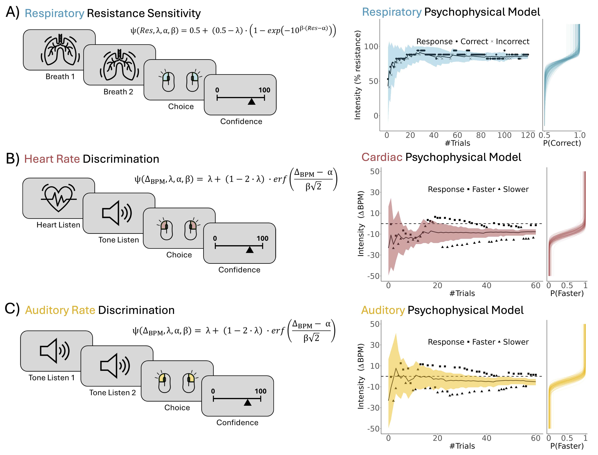
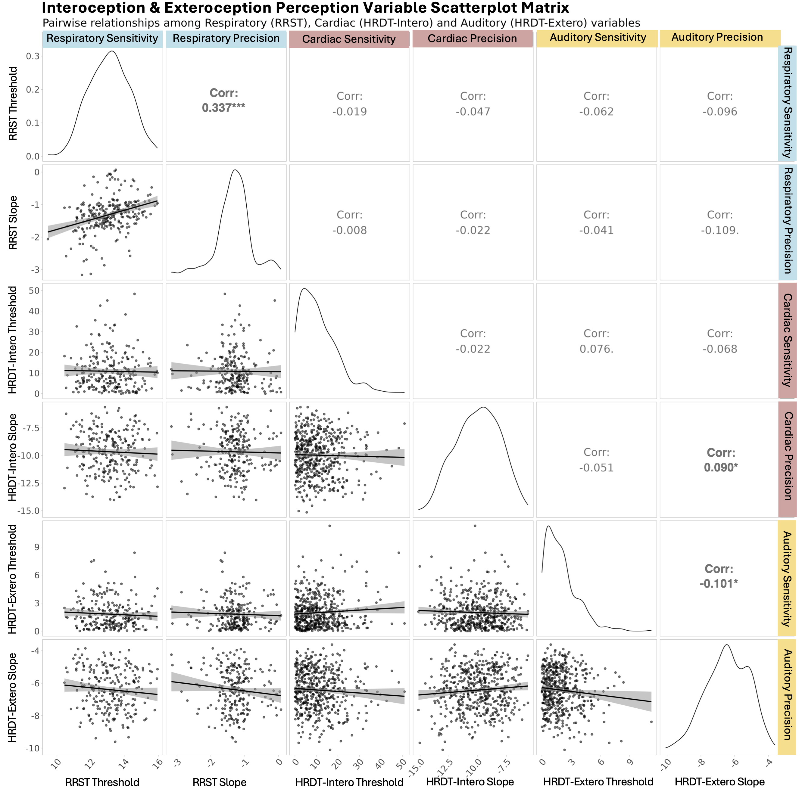
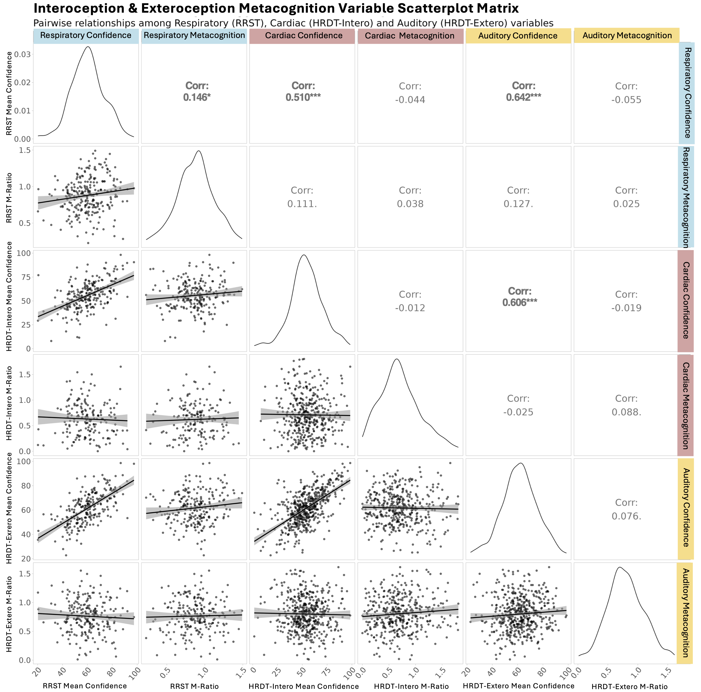
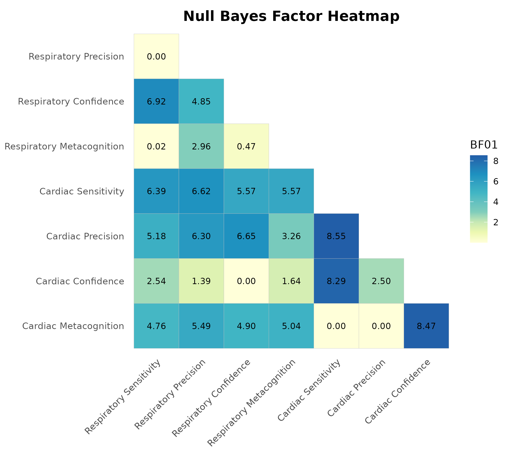

# Interoceptive ability is uncorrelated across respiratory and cardiac axes:a large scale psychophysical study

Leah Banellis, Niia Nikolova, Jesper Fischer Ehmsen, Arthur S. Courtin, Melina Vejlø, Ashley Tyrer, Rebecca A. Böhme, Francesca Fardo, Micah G. Allen.

---

## Abstract

Interoception, the perception of internal bodily signals, is thought to be fundamental for emotional regulation and cognitive functioning. While previous studies have indicated a degree of shared variance in interoceptive processes across cardiac and respiratory systems, evidence remains limited due to methodological constraints and small sample sizes. This study aimed to investigate individual differences in cardiac and respiratory interoception, as well as auditory exteroception across sensitivity, precision, and metacognition using consistent psychophysical approaches. In a sample of 241 participants, we found no significant correlations between cardiac and respiratory interoceptive dimensions, with the exception of a modest positive association in subjective confidence. Bayesian analyses provided moderate to substantial evidence supporting the absence of correlations across most dimensions except confidence, suggesting that interoceptive processes may be largely modality-specific, while subjective confidence may be more domain-general. These findings refine theoretical models of interoception and highlight the importance of modality-specific psychophysical approaches in both cognitive and clinical research on interoceptive ability.

---

## Preprint

Access the preprint here: [https://osf.io/preprints/psyarxiv/s56v4_v1?view_only=](https://osf.io/preprints/psyarxiv/s56v4_v1?view_only=)

---

## Citation

> Banellis, L., Nikolova, N. E., Ehmsen, J. F., Courtin, A., Vejlo, M., Tyrer, A., Böhme, R. A., Fardo, F., & Allen, M. (2025, March 19). Interoceptive ability is uncorrelated across respiratory and cardiac axes: a large scale psychophysical study. https://doi.org/10.31234/osf.io/s56v4_v1.

## Figures

# Scripts for Cross-Modal Analyses

**1. Hierarchical Psychophysical Metrics Extracted**:  

    code/fit_and_extract_hrdt.R
    
    code/fit_and_extract_rrst.R

**2. Metacognition (M-Ratio) Extracted**:  

    code/multi_intero_metacog_indiv.R

**3. Perceptual Variable Correlations**:  

    code/intero_cross_core_type1.R
      

**4. Metacognitive Variable Correlations**:

    code/intero_cross_core_type2.R
    
    
**5. All Variable Correlations**:

    code/intero_extero_cross_core_all.R

**6. Null Bayes Factors (BF₀₁)**: 

    code/intero_cross_bayes.R
    
    code/intero_extero_cross_bayes_all.R
    
